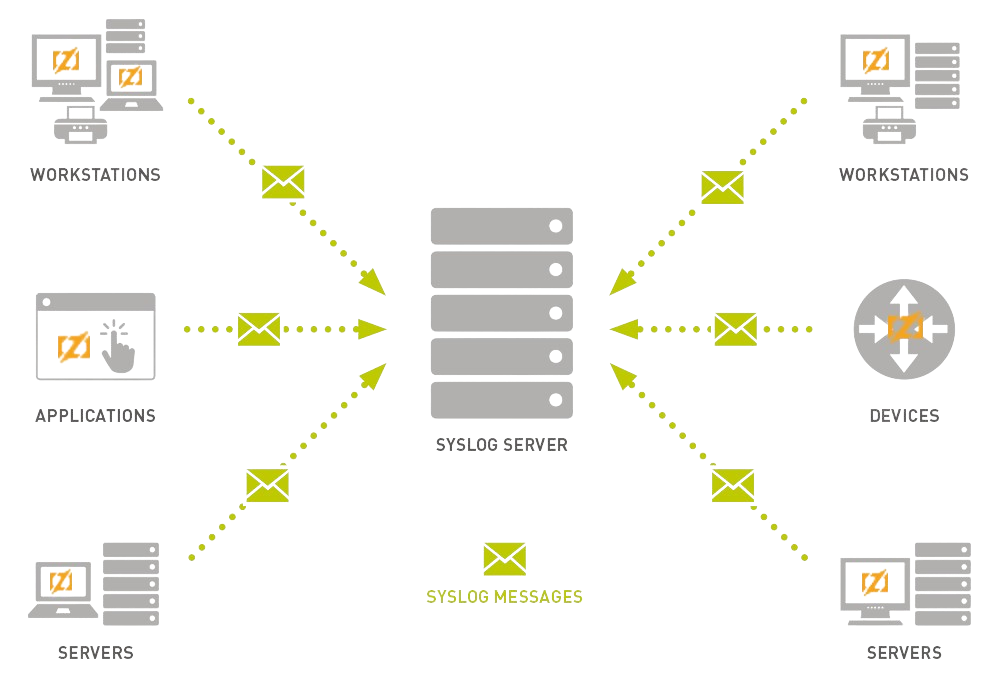

# <center>Zig syslog client</center>

<center>

[](https://github.com/g41797/syslog/actions/workflows/ci.yml)[](https://en.wikipedia.org/wiki/Syslog)
&nbsp;
&nbsp;
&nbsp;

</center>


  This is a [syslog](https://en.wikipedia.org/wiki/Syslog) client library for Zig:

|           |                                                                    |
|-----------|:------------------------------------------------------------------:|
| Protocols |                              UDP, TCP                              |  
| RFC       | Subset of [RFC5424](https://datatracker.ietf.org/doc/html/rfc5424) |
| Tested on |       Mac, Windows, Linux                   |
  
For the curious: [IT Explained:
Syslog](https://www.paessler.com/it-explained/syslog)  
  

## Hello, Zig!
     
When client code calls
```zig
    logger.write_info("Hello, Zig!");
```

[syslog client](src/syslog.zig) sends following text message to syslog receiver process:
>
> <190>1 2024-10-09T09:07:11+00:00 BLKF zigprocess 18548 1 - Hello, Zig!
> 
   
    
Let's see what this message consist of:
   
| Value | RFC Definition  | Description                                            |
|:-----------:|:---------------:|:-------------------------------------------------------|
|   190     |     PRIVAL      | [Priority](#priority)                               |
|   1     |     VERSION     | Always 1                                               |
|   2024-10-09T09:07:11+00:00     |    TIMESTAMP    | FULL-DATE "T" FULL-TIME                                |
|   BLKF     |    HOSTNAME     | Hostname or '-'                                        |
|   zigprocess     |    APP-NAME     | Application name provided by caller                    |
|   18548     |     PROCID      | Process ID or  '-'                                     |
|   1     |      MSGID      | Message ID - sequential number generated automatically |
|   -     | STRUCTURED-DATA | Always '-'                                             |
|   Hello, Zig!     |       MSG       | Message                                                |

   
     
### Priority

>              Priority = Facility * 8 + Severity 

**Facility** represents the machine process that created the Syslog event

| rfc5424.Facility      | Value | Description |
|:----------------------|  :---:           |          :--- |
| .kern                 | 0  |     kernel messages |
| .user                 | 1  |     random user-level messages |
| .mail                 | 2  |     mail system |
| .daemon               | 3  |     system daemons |
| .auth                 | 4  |     security/authorization messages |
| .syslog               | 5  |     messages generated internally by syslogd |
| .lpr                  | 6  |     line printer subsystem |
| .news                 | 7  |     network news subsystem |
| .uucp                 | 8  |     UUCP subsystem |
| .cron                 | 9  |     clock daemon |
| .authpriv             | 10 |     security/authorization messages (private) |
| .ftp                  | 11 |     ftp daemon |
| .local0               | 16 |     local use 0 |
| .local1               | 17 |     local use 1 |
| .local2               | 18 |     local use 2 |
| .local3               | 19 |     local use 3 |
| .local4               | 20 |     local use 4 |
| .local5               | 21 |     local use 5 |
| .local6               | 22 |     local use 6 |
| .local7               | 23 |     local use 7 |
 
     
  
**Severity** describes the severity level of the syslog message in question.

| Level | rfc5424.Severity | Description |
| :---:          |:-----------------|          :--- |
|0| .emerg           |  system is unusable               |
|1| .alert           |  action must be taken immediately |
|2| .crit            |  critical conditions              |
|3| .err             |  error conditions                 |
|4| .warning         |  warning conditions               |
|5| .notice          |  normal but significant condition |
|6| .info            |  informational                    |
|7| .debug           |  debug-level messages             |


### Quiz

What are *Facility* and *Severity* of **"Hello, Zig!"** message?

### For leisure time

- [What is Syslog?](https://www.auvik.com/franklyit/blog/what-is-syslog/)
- [syslog-ng Open Source Edition](https://www.syslog-ng.com/products/open-source-log-management/)
- [The rocket-fast system for log processing](https://www.rsyslog.com/)
- [Old brave syslogd](https://linux.die.net/man/8/syslogd)
- [Kafka syslog connector](https://www.confluent.io/hub/confluentinc/kafka-connect-syslog)
- [Nats syslog connector](https://github.com/g41797/syslog2nats)

## Installation

Add *syslog* to build.zig.zon:
```bach
zig fetch --save=syslog git+https://github.com/g41797/syslog
```

Add *syslog* to build.zig:
```zig
    const syslog = b.dependency("syslog", .{
        .target = target,
        .optimize = optimize,
    });

    const lib = b.addStaticLibrary(..);
    lib.root_module.addImport("syslog", syslog.module("syslog"));

    const lib_unit_tests = b.addTest(...);
    lib_unit_tests.root_module.addImport("syslog", syslog.module("syslog"));
```

Import *syslog*: 
```zig
const syslog = @import("syslog");
```

## Usage

### Configuration

syslog uses following configuration:
```zig
pub const SyslogOpts = struct {
    // application:
    name: []const u8 = "zigprocess",
    fcl: rfc5424.Facility = .local7,

    // transport:
    proto: Protocol = .udp,
    addr: []const u8 = "127.0.0.1",
    port: u16 = 514,
};
```

### Initialization

```zig
    var logger: syslog.Syslog = .{};
    try logger.init(std.testing.allocator, .{
        .name = "runner",
        .fcl = .daemon
        .port = 12345,
    });
    defer logger.deinit();
```

After initialization you can call syslog on different threads.

### Logging  
There are two groups of APIs:
- write: message is straight text 
```zig
    pub inline fn write_<severity>(slog: *Syslog, msg: []const u8) !void {...}
    ....
    logger.write_debug("Hello, Zig!");
```
- print: message will be formatted before send
```zig
    pub inline fn print_<severity>(slog: *Syslog, comptime fmt: []const u8, msg: anytype) !void {...}
    ....
    const name = "World";
    logger.print_debug("Hello, {s}!", .{name});
```

### Filtering

Set filter:
```zig
    // disable send messages with .info & .debug severities
    logger.setfilter(.info);// disable send messages with .info & .debug severities 
```

Reset filter:
```zig
    logger.setfilter(null); 
```

## AI Usage

The following refactoring was performed by [Claude Code](https://claude.com/product/claude-code):

* **Explicit Pointer Dereferencing**: Removed "Automatic pointer dereference" and replaced it with explicit `ptr.*` syntax.
* **Explicit Type Declaration**: Removed "Type Inference" by adding explicit types to all variable declarations.

Related configuration files and guidelines are located in the [.claude/rules](.claude/rules) directory.

## License
[MIT](LICENSE)
